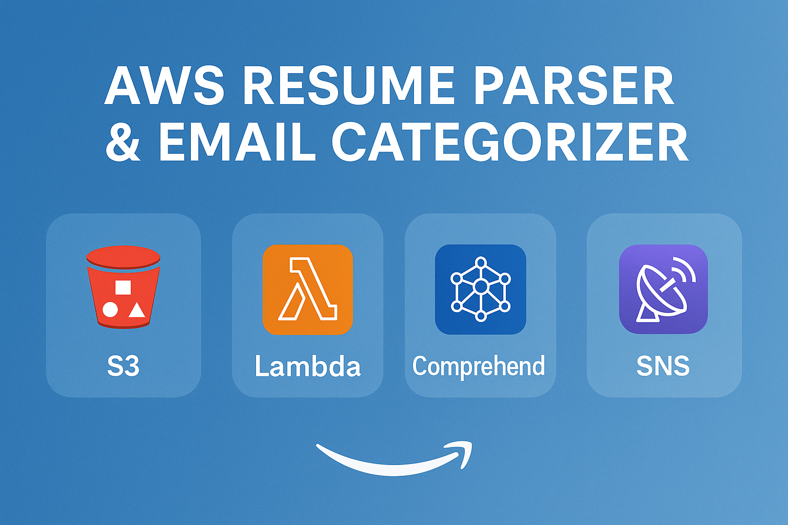
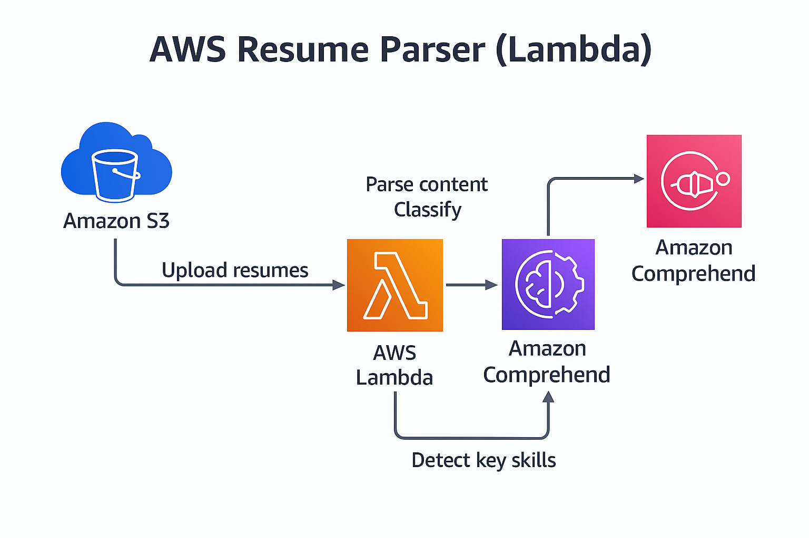

# **AWS Resume Parser using Lambda, S3 & Comprehend**

*Automated resume analysis with NLP, skill extraction, and instant email notifications.*

---

<p align="center">
  
</p>

<p align="center">
  
  
  
  
  
  
</p>

---

# 📌 **Project Overview**

This serverless pipeline parses uploaded resumes (PDF, DOCX, TXT), extracts skills and key phrases using **Amazon Comprehend**, and automatically sends a summary email through **SNS**.

It is event-driven and requires **no servers or EC2 instances**.

---

# 🚀 **Architecture**

<p align="center">
  
</p>

---

# 🧠 **How It Works**

1. User uploads a resume to **S3 (upload bucket)**
2. S3 triggers a Lambda function
3. Lambda extracts text from PDF/DOCX/TXT
4. Extracted text is analyzed using **Comprehend NLP**
5. Lambda stores structured JSON output in **output bucket**
6. SNS sends recruiter-friendly email with:

   * detected skills
   * dominant language
   * sample extracted text

---

# 🏗️ **AWS Services Used**

| Service            | Purpose                                         |
| ------------------ | ----------------------------------------------- |
| **S3**             | Stores input resumes & parsed results           |
| **Lambda**         | Parses documents, runs NLP, sends notifications |
| **AWS Comprehend** | Extracts skills, entities, keywords             |
| **SNS**            | Sends email notifications                       |
| **IAM**            | Secures Lambda with least-privilege access      |
| **CloudWatch**     | Logs and debugging                              |

---

# 🛠️ **Project Folder Structure**

```
aws-resume-parser-lambda/
│── lambda/
│   └── lambda_function.py
│
│── iam/
│   └── lambda_resume_policy.json
│
│── docs/
│   ├── banner.png
│   ├── architecture.png
│   └── screenshots/
│       ├── cloudwatch.png
│       ├── sns-email.png
│       └── output-json.png
│
│── .gitignore
│── LICENSE
│── README.md
```

---

# 🔧 **Setup Instructions**

## **1️⃣ Create S3 Buckets**

* Upload bucket → `resumeuploadsiddu`
* Output bucket → `resumeparsedoutputsiddu`

Enable versioning (optional but recommended).

---

## **2️⃣ Create SNS Topic**

SNS → Create Topic → Standard →
Name: `ResumeParserNotifications`

Add Email Subscription → Confirm email.

---

## **3️⃣ Create IAM Role for Lambda**

Attach this policy: lambda_resume_policy.json
```

---

## **4️⃣ Create Lambda Function**

* Runtime: **Python 3.9**
* Timeout: **30 seconds**
* Memory: **512 MB**
* Handler: `lambda_function.lambda_handler`
* Upload your code inside `/lambda/lambda_function.py`

---

## **5️⃣ Add Environment Variables**

| Key             | Value                                                    |
| --------------- | -------------------------------------------------------- |
| `UPLOAD_BUCKET` | resumeuploadsiddu                                        |
| `OUTPUT_BUCKET` | resumeparsedoutputsiddu                                  |
| `SNS_TOPIC_ARN` | arn:aws:sns:ap-south-1:xxxxxxx:ResumeParserNotifications |

---

## **6️⃣ Attach Lambda Layer**

Layer must include:

```
python/
   ├── docx/
   ├── pdfminer/
   ├── lxml/
   ├── cryptography/
   └── dependencies...
```
```
# ✅ **METHOD 1 - Create it from CloudShell or EC2**:

```bash
pip3 install python-docx pdfminer.six lxml cryptography -t python/
zip -r text_extract_layer.zip python/
```

Then upload manually via:

Lambda → Layers → Create Layer

# **OR you can use this method also**

Got it — **if CloudShell is not working, we will still fix it 100%**.
There are *two alternative methods* that work even if CloudShell is broken:

---

# ✅ **METHOD 2 — Build the Lambda Layer on EC2 (100% works)**

(Requires ~2 minutes and a free-tier EC2 instance)

### **STEP A — Launch EC2**

* Go to EC2 → Launch Instance
* Name: `layer-builder`
* AMI: **Amazon Linux 2023**
* Instance type: **t2.micro (free tier)**
* Key pair: any
* Security group: allow SSH

---

### **STEP B — SSH into EC2**

Use:

```bash
ssh -i "yourkey.pem" ec2-user@<EC2-Public-IP>
```

---

### **STEP C — Create the layer folder**

```bash
mkdir layer
cd layer
mkdir python
```

---

### **STEP D — Install Linux-compatible libraries**

```bash
sudo dnf install python3-pip -y
python3 --version
pip3 --version
pip3 install python-docx pdfminer.six lxml cryptography -t python/
```

---

### **STEP E — Zip it**

```bash
zip -r text_extract_layer.zip python/
```

---

### **STEP F — Upload layer to Lambda**

Download zip from EC2 → upload manually
OR upload directly from EC2 to S3:

```bash
aws s3 cp text_extract_layer.zip s3://<your-bucket-name>/
```

Then:

Lambda → Layers → Create Layer → Upload ZIP

---

# 🎯 RESULT

This EC2-built layer **will ALWAYS work** — because it uses Linux binaries exactly like Lambda.

---

## **7️⃣ Add S3 Trigger**

S3 → Upload Bucket → Properties → Event Notifications:

* Event: **PUT**
* Prefix: (optional)
* Send to: **Lambda**
* Function: ResumeParserLambda

---

# 🧪 **Testing the Project**

1. Upload: `resume.pdf` to `resumeuploadsiddu`
2. Lambda logs → CloudWatch
3. Output JSON → `resumeparsedoutputsiddu/parsed/resume.json`
4. Email notification arrives via SNS

---

# 📄 **Sample Output JSON**

```json
{
  "file_name": "resume.pdf",
  "extracted_text_len": 1823,
  "entities": [...],
  "key_phrases": [...],
  "dominant_language": [{"LanguageCode": "en"}]
}
```

---

# ✉️ **Sample Email (SNS)**

```
Resume Parsed Successfully!

File: resume.pdf
Top Skills: Python, AWS, Lambda
Dominant Language: en
Sample Text:
Experienced cloud engineer with hands-on experience...
```

---

# 🧩 **My Contributions**

Developed by **Siddu S.N**

✔ Built full serverless architecture
✔ Integrated Comprehend NLP for skill extraction
✔ Implemented S3 → Lambda → S3 pipeline
✔ Designed IAM least-privilege access
✔ Added robust error handling & production-ready Lambda
✔ Created documentation, diagrams, and GitHub repo structure

---

# 🛣️ **Future Improvements**

* Auto-classify resumes (Developer / Cloud / ML / Network)
* Push parsed data into DynamoDB
* Add Textract for scanned PDF support
* Add Web UI for resume uploads

---

# 📜 License

This project is licensed under the **MIT License**.

